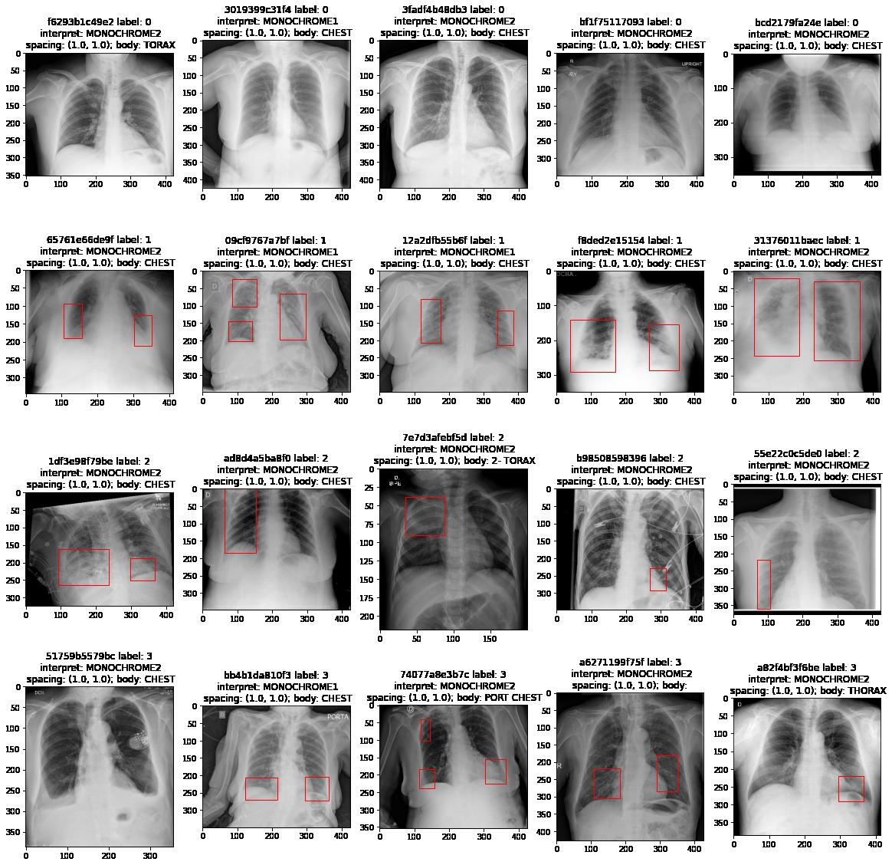
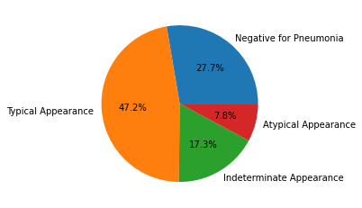
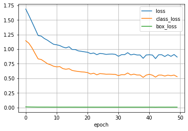
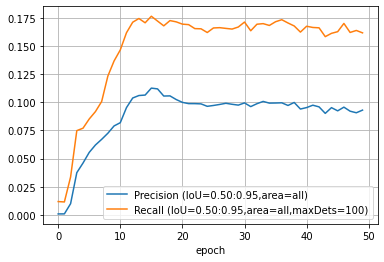

# Kaggle: [COVID-19 Detection](https://www.kaggle.com/c/siim-covid19-detection)

[](https://github.com/Borda/kaggle_COVID-detection/actions/workflows/ci_testing.yml)
[](https://github.com/Borda/kaggle_COVID-detection/actions/workflows/code-format.yml)
[](https://codecov.io/gh/Borda/kaggle_COVID-detection)
[](https://results.pre-commit.ci/latest/github/Borda/kaggle_COVID-detection/main)

In this competition, you’ll identify and localize COVID-19 abnormalities on chest radiographs.
In particular, you'll categorize the radiographs as negative for pneumonia or typical, indeterminate, or atypical for COVID-19.
Organizers provided dataset - imaging data and annotations from a group of radiologists.



In other words the task to solve is image classification accompanied by attention

- user shall classify patient COVID19 situation and also tell why think so, what are the regions in the scan that makes him think this case is positive.



## Experimentation

### install this tooling

A simple way how to use this basic functions:

```bash
! pip install https://github.com/Borda/kaggle_COVID-detection/archive/main.zip
```

### run notebooks in Kaggle

- [COVID199 detection with Flash ⚡](https://www.kaggle.com/jirkaborovec/covid-detection-with-lightning-flash)
- [COVID199 detection - predictions](https://www.kaggle.com/jirkaborovec/covid-detection-with-lightning-flash-predictions)

### some results

Training progress with ResNet50 with training  for 50 epochs:



